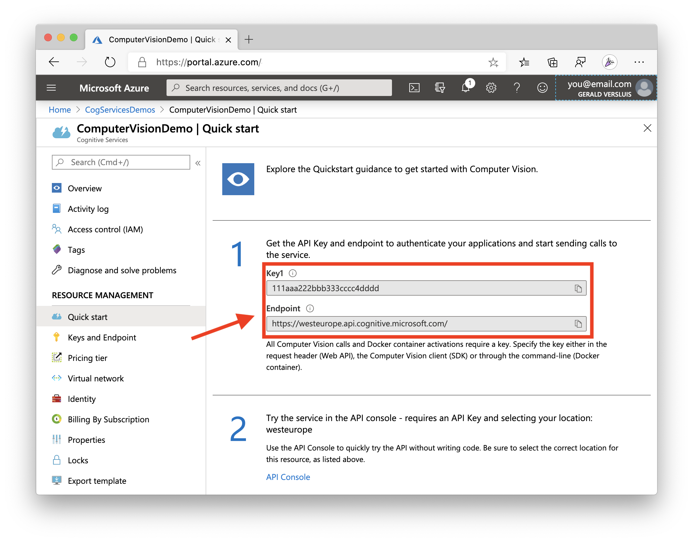

#  TravelMonkey

 [](https://dev.azure.com/jfversluis/TravelMonkey/_build/latest?definitionId=44&branchName=master)

Fasten your seatbelts! You may not be able to travel now... but this summer when you can, this app is going to be your best friend!

Extend this intelligent travel companion app and be prepared for your next travel. Oh, and did we mention you will get some cool swag to take in your suitcase?

Check out [this article](https://devblogs.microsoft.com/xamarin/cognitive-services-xamarin-challenge/?WT.mc_id=aiapril-xamblog-masoucou) for all the details.

## The Challenge

Your challenge is to add some new functionality to this app. It can be whatever functionality you want! All you need to do is fork this repository, make your changes, and then make a PR. Let us know what you did and how it went! If the PR is in by April 30, 2020 - we'll send you some swag!

Right now, the app uses [Microsoft Cognitive Services Computer Vision](https://docs.microsoft.com/azure/cognitive-services/computer-vision/home?WT.mc_id=aiapril-github-masoucou) to describe your pictures and recognize landmarks and [Translator Text](https://docs.microsoft.com/azure/cognitive-services/translator/?WT.mc_id=aiapril-github-masoucou) to help you while abroad. Lastly, with [Bing Search](https://docs.microsoft.com/azure/cognitive-services/bing-web-search/?WT.mc_id=aiapril-github-masoucou) we're giving you some travel inspiration on the main screen. The app is entirely built with [Xamarin.Forms](https://dotnet.microsoft.com/apps/xamarin/xamarin-forms?WT.mc_id=aiapril-github-masoucou).

Your challenge is to extend the app in any way. This might include, but is certainly not limited to:

* Improve design or redesign with [`Shell`](https://docs.microsoft.com/xamarin/xamarin-forms/app-fundamentals/shell/?WT.mc_id=aiapril-github-masoucou) for example
* Add a detail screen to be able to reopen the pictures or save previous translation results
* Detect faces in pictures and/or detect emotion in said faces with [Cognitive Services Face](https://docs.microsoft.com/azure/cognitive-services/face/?WT.mc_id=aiapril-github-masoucou)
* See if the person speaking in a foreign tongue likes you by detecting the sentiment in the translation [Text Analytics - Sentiment Analysis](https://docs.microsoft.com/azure/cognitive-services/text-analytics/quickstarts/text-analytics-sdk?pivots=programming-language-csharp&tabs=version-3&WT.mc_id=aiapril-github-masoucou#sentiment-analysis)
* Abstract the services into an [Azure Function](https://docs.microsoft.com/azure/azure-functions/?WT.mc_id=aiapril-github-masoucou)
* The sky is the limit! Bring your best ideas! And let us know how it went in implementing them!

## Getting Started

To be able to run the app you will need to do a little setup. No worries, you can all do this for free! That's right, for free! You can also watch the Getting Started video [here](https://youtu.be/_a1Qptxyibo).

### Creating a Resource Group

1. If you don't already have one, [sign up for a free Azure subscription here](https://azure.microsoft.com/free/?WT.mc_id=aiapril-github-masoucou).
2. Once done, open up the Azure portal: [https://portal.azure.com](https://portal.azure.com) - and sign in.
3. Then open up the [`Azure Cloud Shell`](https://docs.microsoft.com/azure/cloud-shell/overview?WT.mc_id=aiapril-github-masoucou). You can do that by clicking on the button that looks like the command prompt.


4. Once the `Cloud Shell` opens, you'll want to do two things. Create a `Resource Group` and then the `Computer Vision` service. So go ahead and think of names for both right now ... you'll need them for the next step(s). We will be reusing the `Resource Group` for the other services as well.
5. Enter the following command in the `Cloud Shell`. For faster response times you might want to choose a different region than `westus2`, but if you're unsure; this region will work just as well. You can find all locations with the command `az account list-locations -o table`.

```language-bash
az group create -l westus2 -g YOUR-RESOURCE-GROUP-NAME-GOES-HERE
```

### Creating the Computer Vision Service

Once the `Resource Group` is created, then you can create the `Computer Vision` service. Enter the following command in the `Cloud Shell`.

```language-bash
az cognitiveservices account create \
--kind ComputerVision \
--location westus2 \
--sku F0 \
--resource-group RESOURCE-GROUP-NAME-FROM-FIRST-STEP \
--name YOUR-SERVICE-NAME-GOES-HERE
```

That's it! What's neat is that the `--sku F0` indicates the free tier of `Computer Vision`. Or any other cognitive service for that matter!

Then you'll be able to browse the `Computer Vision` service you just created. Make note of the Endpoint url and the Key value, you will need to enter them in the `ApiKeys.cs` file.

You can see an example on where to find them below. Note: the endpoint URL differs based on the chosen Azure region. Make sure you enter the right one in the app



### Creating the Translator Text Service

Now rinse and repeat for the `Translator Text` service.

Enter the following command in the `Cloud Shell`. Note that the `location` paramter for this needs to be `global`.

```language-bash
az cognitiveservices account create \
--kind TextTranslation \
--location global \
--sku F0 \
--resource-group RESOURCE-GROUP-NAME-FROM-FIRST-STEP \
--name YOUR-SERVICE-NAME-GOES-HERE
```

Again, note the API key value from the portal and enter it into the `ApiKeys.cs` file. (You do not have to change the endpoint.)

### Creating the Bing Search Service

And lastly let's create the `Bing Search` service.

Enter the following command in the `Cloud Shell`. Note that the `location` parameter for this needs to be `global`. Also, you will need to accept the service terms, make sure you read and understand them.

```language-bash
az cognitiveservices account create \
--kind Bing.Search.v7 \
--location global \
--sku F1 \
--resource-group RESOURCE-GROUP-NAME-FROM-FIRST-STEP \
--name YOUR-SERVICE-NAME-GOES-HERE
```

*Although the sku lists `F1` here, don't worry! This is the free tier for Bing Search*

Same thing with the key! Copy it on over to the `ApiKeys.cs` file.

All done! 🙌

## Ready for Takeoff

This is your captain speaking: we are now cleared to make some amazing changes in our app. We can't wait to see what you come up with.

Thank you for traveling with TravelMonkey!

## Credits, Recognitions & Others

My good friend [Steven Thewissen](https://thewissen.io/) has been so kind to create the TravelMonkey logo as well as lending me his [awesome UI design](https://github.com/sthewissen/KickassUI.Traveler) for this app.

Other resources used in the app are from:

* Country flag images from [flaticon.com](https://www.flaticon.com/packs/countrys-flags)
* Images by Bing Image search with the license on public domain
* Icons used in the UI by [FontAwesome](https://fontawesome.com/)
* UI main font is [Lato](https://fonts.google.com/specimen/Lato) by Google
* [Cat-as-a-Service](https://cataas.com/) for when Bing Search fails us

### The Making Of...

I have been doing some streams to create this app, which can be found [here](https://www.youtube.com/watch?v=Y-rd_GP5dag&list=PLfbOp004UaYXwpVzT1HQxHqwzGg2cLWFZ).

### Third-Party Libraries

During the creation of this app I have used a number of third-party libraries to make my life easier. Find a list with links here. They deserve your support in whatever way you can!

* [Xamarin.Forms](https://github.com/xamarin/Xamarin.Forms) by Microsoft
* [userdialogs](https://github.com/aritchie/userdialogs) by [Allan Ritchie](https://allancritchie.net/)
* [PancakeView](https://github.com/sthewissen/Xamarin.Forms.PancakeView) by [Steven Thewissen](https://thewissen.io)
* [Xamarin.Essentials](https://github.com/xamarin/Essentials) by Microsoft
* [MediaPlugin](https://github.com/jamesmontemagno/MediaPlugin) by [James Montemagno](https://montemagno.com)
* [Microsoft.Azure.CognitiveServices.Search.ImageSearch](https://github.com/Azure/azure-sdk-for-net) by Microsoft
* [Microsoft.Azure.CognitiveServices.Vision.ComputerVision](https://github.com/Azure/azure-sdk-for-net) by Microsoft
